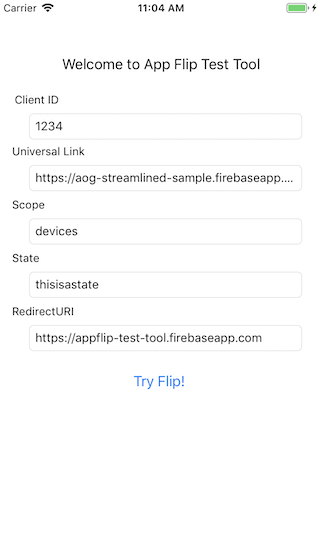

# App Flip Test Tool for iOS

The App Flip Test Tool is designed to verify your iOS app's integration with
App Flip for Google account linking.
This app simulates the intent triggered by Google mobile apps when App Flip is enabled.
Use this tool to debug issues you may be experiencing with App Flip and account linking
in your iOS app.

The App Flip Test Tool can be used to test with the Google
[App Flip Sample for iOS](https://github.com/googlesamples/identity-appflip-ios),
or your own iOS app with an App Flip account linking integration.

Documentation links:

- [App Flip Overview](https://developers.google.com/identity/account-linking/app-flip-overview)
- [App Flip for iOS](https://developers.google.com/identity/account-linking/app-flip-ios)

## Prerequisites

1. Xcode installed (version 10.0 or above)
1. iOS device (iOS 10.0 or above)
1. [Universal links](https://developer.apple.com/documentation/uikit/inter-process_communication/allowing_apps_and_websites_to_link_to_your_content/enabling_universal_links)
   configured for your app:
   - Associated Domains Entitlement in your app project
   - Apple App Site Association file hosted on your domain with `applinks` defined

## Getting started

1. Open this project in Xcode
1. Enter a unique **Bundle Identifier** and set your **Provisioning Profile**
   in the Xcode project settings.
1. Create an `apple-app-site-association` file to whitelist your app identifier:
    ```
    {
      "applinks": {
        "apps": [],
        "details": [{
          "appID": "D3KQX62K1A.com.sample.app",
          "paths": ["*"]
        }]
      }
    }
    ```

   Use the following format for app identifiers: `<Team Identifier>.<Bundle Identifier>`

1. Host this file at `https://<your-website-domain>/.well-known/apple-app-site-association`
1. Add the following to your **Associated Domains** in Xcode project settings:
   `applinks:<your-website-domain>`
1. Open Config.plist and edit the following values:
   - `appFlipLinkAddress`: Universal link URL configured with App Flip for your app
   - `clientID`: Client identifier configured with App Flip for your app
   - `scope`: Optional additional auth scopes configured with App Flip for your app. Multiple scopes can be added using `+` spacing, e.g. `scope1+scope2`.
   - `redirectUri`: Universal link URL to return to the test tool app (configured
     using the above steps)


## Usage

Launch the test tool application on your device, and tap **Try Flip**.
The device should launch your iOS app to complete the authorization flow.
After completing user authorization, the test tool will display any `auth_code`
or `error` messages in the log.

## Screenshots



## License

Copyright 2019 Google LLC

Licensed under the Apache License, Version 2.0 (the "License");
you may not use this file except in compliance with the License.
You may obtain a copy of the License at

    http://www.apache.org/licenses/LICENSE-2.0

Unless required by applicable law or agreed to in writing, software
distributed under the License is distributed on an "AS IS" BASIS,
WITHOUT WARRANTIES OR CONDITIONS OF ANY KIND, either express or implied.
See the License for the specific language governing permissions and
limitations under the License.
